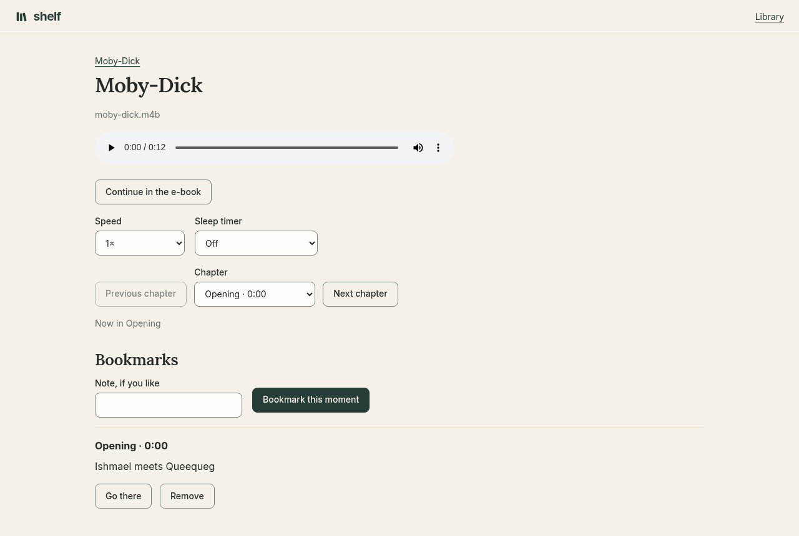
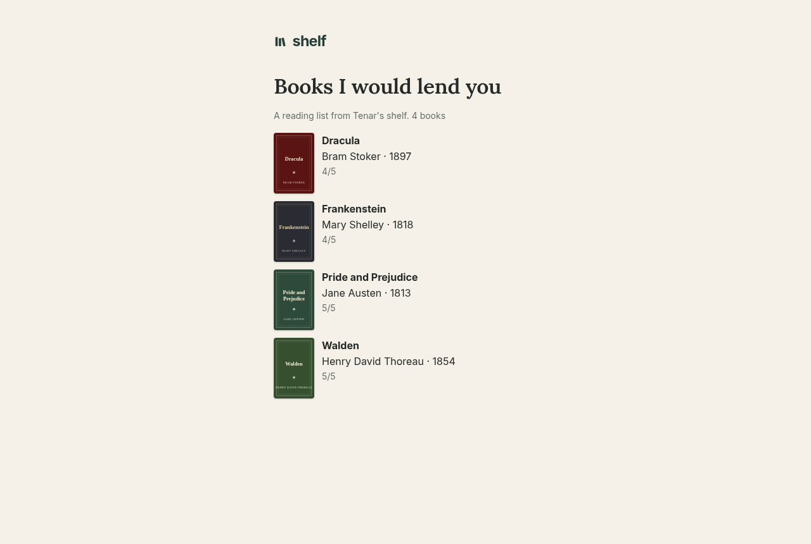

# Shelf

[](https://github.com/doodersrage/shelf/actions/workflows/ci.yml)

**[Read the documentation](https://doodersrage.github.io/shelf/)**: installing, every feature, configuration, and the API.

A personal library you run yourself. Shelf keeps the books you own on paper, your e-books, and your audiobooks together, one book at a time: the catalog, where you stopped in each format, what you highlighted, your reading log and yearly goal, and who has borrowed which copy. Everyone on your server gets a shelf of their own and can lend to the others.


| | |
| --- | --- |
|  |  |
| **The whole shelf** as covers or a compact list, with search, filters, and saved searches. | **A book's page** leads with the cover and one next step, then the reading log, lending, quotes, highlights, and files. |
|  |  |
| **The reader** keeps your place, highlights, notes, and text settings, and reads aloud. | **The player** keeps chapters, bookmarks, your speed, and a sleep timer, and switches to the e-book at the same point. |
|  |  |
| **Stats** lead with the year's goal and a month-by-month chart. | **Loans** between readers, and asks to borrow from an open shelf. |
|  |  |
| **A reading list** shared by link with anyone, showing only the books. | **Dark mode** follows the system setting. |

<p align="center"></p>

The screenshots show public-domain books, with covers drawn for the demo. `npm run screenshots` in `tests/e2e` makes them again.

## Why Shelf

Good self-hosted book apps already exist, and each is built around one kind of book:

- **[Calibre-Web](https://github.com/janeczku/calibre-web)** is a web front end to a Calibre library. It is the better choice if Calibre is where you edit metadata and convert files. It keeps e-books only, in Calibre's database.
- **[Audiobookshelf](https://www.audiobookshelf.org)** is an audiobook and podcast server with phone apps that download for offline listening. It is the better choice if that is most of your reading. E-books come second there, and paper books not at all.
- **Goodreads and StoryGraph** keep a reading log and a yearly goal well, but on someone else's server, and they hold none of your files.

Shelf is for a library that is all of these at once, kept on your own server:

- **One book, every format.** A paperback, its EPUB, and its audiobook are the same book, with one reading log. **Continue in the e-book** and **Continue in the audiobook** carry your place across.
- **Paper books count.** Where each copy sits, its condition, who recommended it, an inscription, and loans to friends, with due dates and reminders.
- **Readers lend to each other.** A borrower reads or listens with their own place and highlights, and the owner's notes stay private.
- **Come as you are.** Shelf brings in Calibre libraries, Audiobookshelf servers, Goodreads and StoryGraph exports, folders of files, and free public-domain books. Your own data goes out as JSON, Markdown notes, or one zip with every file.

What it does not have, yet, is phone apps: on a phone it is the website, added to the home screen, with offline reading for kept e-books.

## What it does

- **[A real catalog](https://doodersrage.github.io/shelf/library.html):** series, editions, translators, places, condition, ratings, reviews, and tags. Fill it from an ISBN, typed or scanned with a phone's camera. Saved searches, new books in your series, and reading lists shared by link.
- **[Reading](https://doodersrage.github.io/shelf/reading.html):** EPUBs, PDFs, comics, and Kindle files in the browser, with highlights, notes, read aloud, search inside every book, OCR for scanned PDFs, and offline reading.
- **[Audiobooks](https://doodersrage.github.io/shelf/audiobooks.html):** one file or a folder of tracks, with chapters, bookmarks, speed, a sleep timer, and lock-screen controls.
- **[Readers and lending](https://doodersrage.github.io/shelf/lending.html):** a shelf for each reader, loans with due dates, open shelves to ask to borrow from, and email reminders.
- **[Bringing books in](https://doodersrage.github.io/shelf/adding.html):** files, an import folder, Calibre, Audiobookshelf, Goodreads, StoryGraph, and Project Gutenberg and LibriVox.
- **[Devices](https://doodersrage.github.io/shelf/devices.html):** KOReader downloads from Shelf's catalog, keeps its place in step, and brings its highlights across; Kindles get books by email, and two shelves trade files.
- **[Security](https://doodersrage.github.io/shelf/security.html):** passkeys, two-step sign-in, single sign-on through OpenID Connect, an activity log, and [API tokens](https://doodersrage.github.io/shelf/api.html#api-tokens) for scripts and Home Assistant.
- **[Backups](https://doodersrage.github.io/shelf/backups.html):** nightly snapshots, copies to another folder or S3-compatible storage, and a restore drill in the tests.
- **In four languages:** English, Spanish, French, and German, chosen by each reader. The translations were made by machine and want a native speaker's eye; [docs/translating.md](docs/translating.md) shows how to help.

## Install

With Docker, on amd64 or arm64, keeping everything in one volume:

```bash
docker run -d --name shelf -p 8080:8080 -v shelf-data:/data \
  --restart unless-stopped ghcr.io/doodersrage/shelf:latest
```

Open [http://localhost:8080](http://localhost:8080) and make the first account; it becomes the admin. `docker-compose.yml` has the same with the settings worth knowing, commented out. There are templates for [Unraid, TrueNAS, and CasaOS](deploy/), and the [install guide](https://doodersrage.github.io/shelf/install.html) covers those, running from source, updating, and putting Shelf on the internet safely.

## Development

Shelf is .NET 10: ASP.NET Core with Blazor, EF Core on SQLite, and an Aspire AppHost for local runs.

```bash
dotnet run --project Shelf.AppHost --launch-profile http   # the app, with a dashboard of its logs
dotnet test                                               # the server tests
cd tests/e2e && npm ci && npx playwright test             # the browser tests, in Chromium and Firefox
```

[Development](https://doodersrage.github.io/shelf/development.html) covers the pieces, migrations, the design system, dependencies, and releases. [CHANGELOG.md](CHANGELOG.md) records each release.

## Licence

Shelf is free software under the [GNU Affero General Public License, version 3](LICENSE). You may use, study, share, and change it. If you change it and let other people use your changed copy, over a network as well as by handing it to them, you must offer them its source under the same licence. The **Source code** link at the foot of every page points at this repository; a changed copy sets `SourceUrl` to the address of its own source.

Shelf serves some files written by others, under their own licences: [PDF.js](https://github.com/mozilla/pdf.js) (Apache-2.0), [JSZip](https://github.com/Stuk/jszip) (MIT, chosen from MIT or GPL-3.0), [barcode-detector](https://github.com/Sec-ant/barcode-detector) and [zxing-wasm](https://github.com/Sec-ant/zxing-wasm) (MIT, built from [ZXing-C++](https://github.com/zxing-cpp/zxing-cpp), Apache-2.0), and the [Inter](https://github.com/rsms/inter) and [Lora](https://github.com/cyrealtype/Lora-Cyrillic) fonts (SIL Open Font License 1.1, whose texts are in `wwwroot/fonts`). The .NET packages it uses are under MIT or Apache-2.0 licences.
