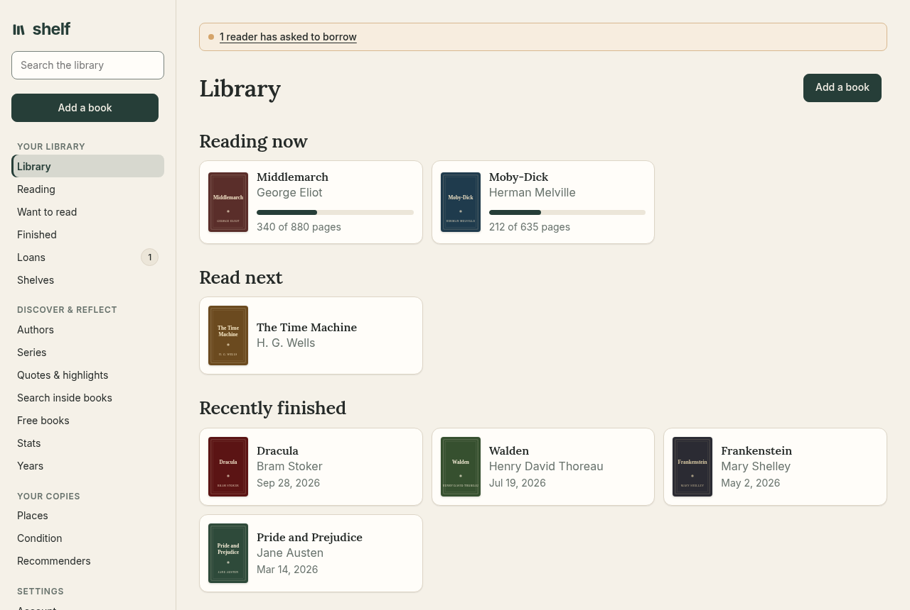
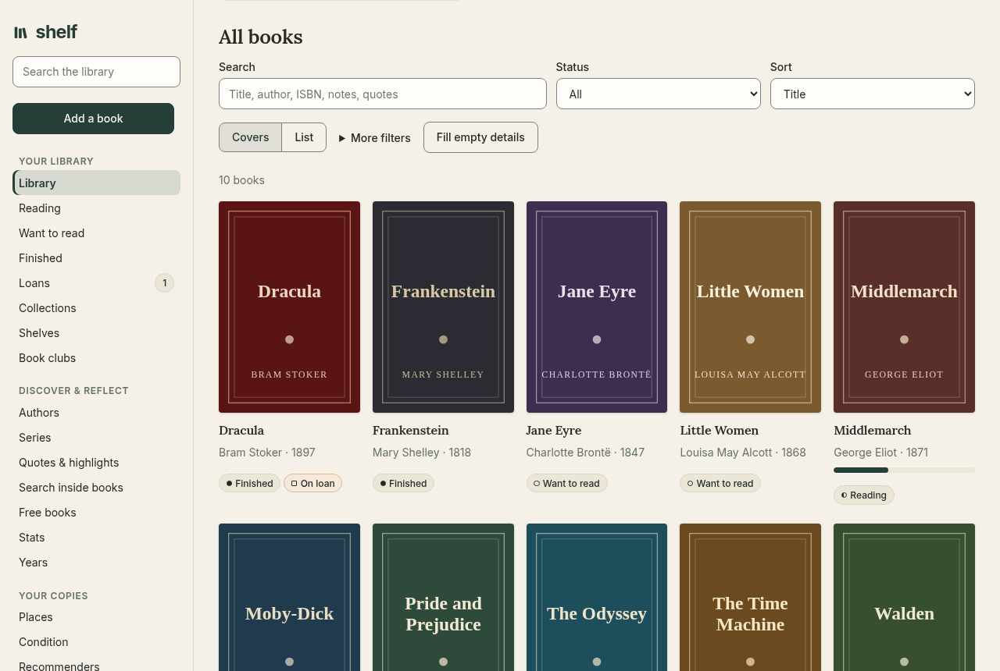
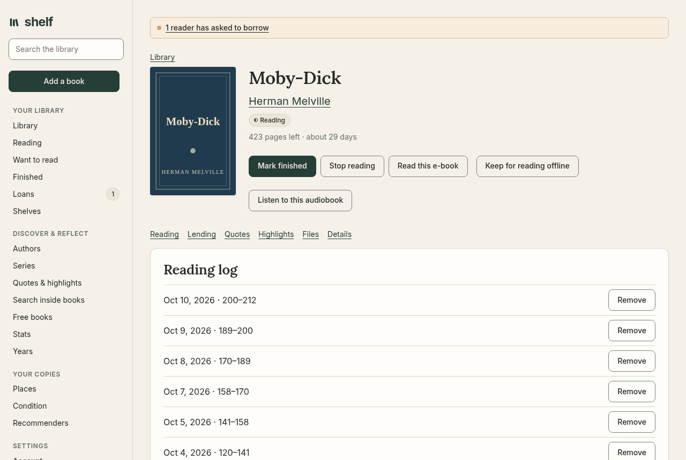
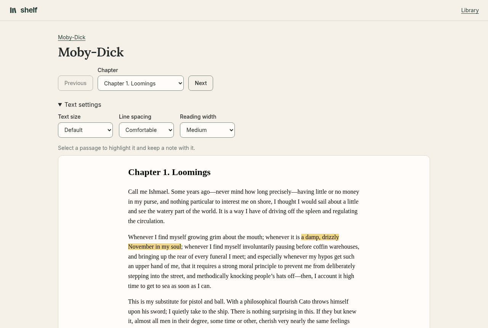
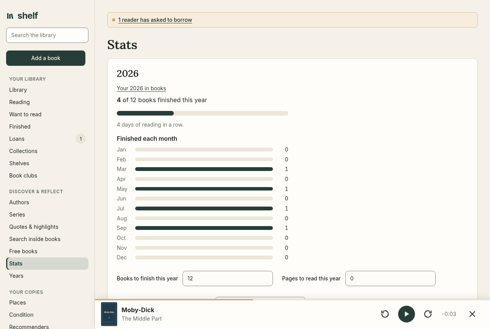
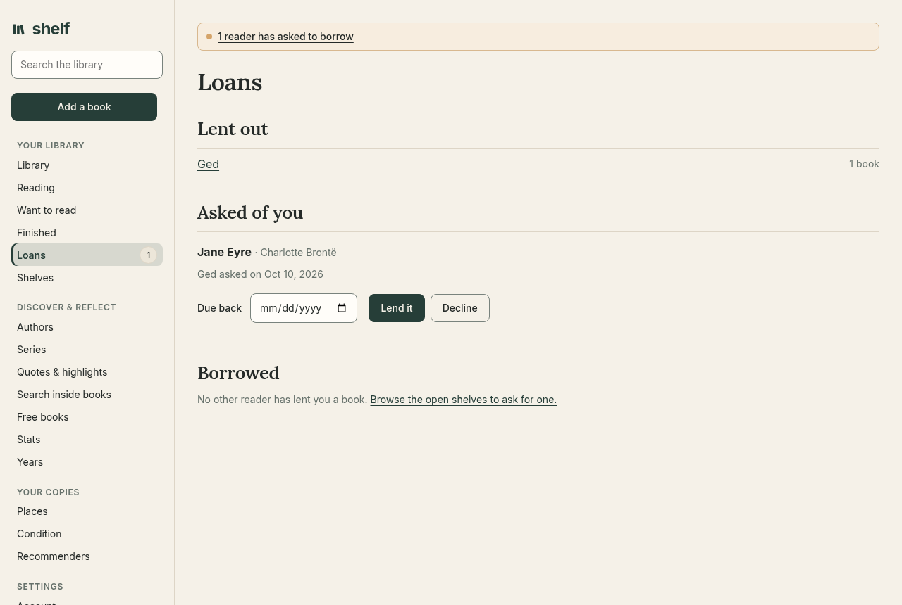
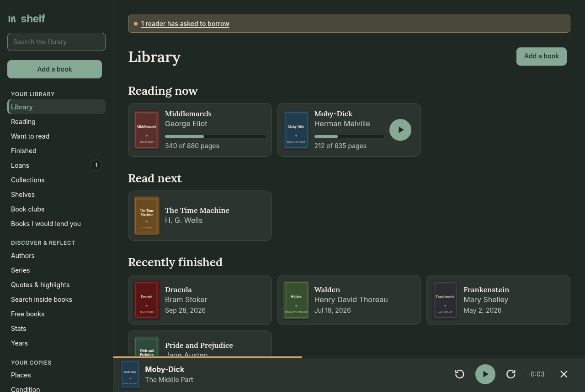
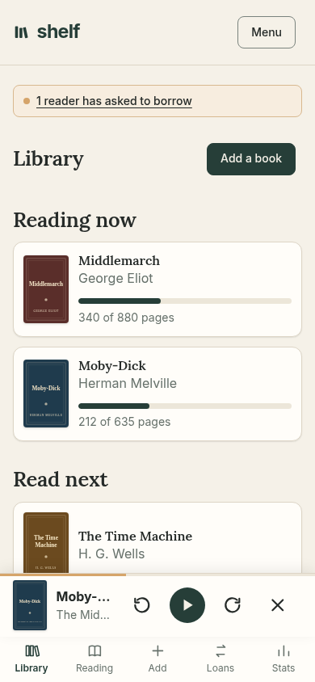

# Shelf

[](https://github.com/doodersrage/shelf/actions/workflows/ci.yml)

A personal library on .NET 10. It keeps the catalog, the reading log, the quotes, loans, and a yearly goal, looks up an ISBN, suggests one book from the want list, and can back the whole shelf up as JSON. Each reader signs in to a shelf of their own and can lend books to the other readers.



| | |
| --- | --- |
|  |  |
| **The whole shelf** as covers or a compact list, with search, status, and sort. | **A book's page** leads with the cover and one next step, then the reading log, lending, quotes, highlights, and files. |
|  |  |
| **The reader** keeps your place, your highlights and notes, and your text size, spacing, and width. | **Stats** lead with the year's goal and a month-by-month chart. |
|  |  |
| **Loans** between readers, and asks to borrow from an open shelf. | **Dark mode** follows the system setting. |

<p align="center"></p>

The screenshots show public-domain books, with covers drawn for the demo.

## Run

With Docker, the image has everything, OCR included, and keeps all its data in one volume:

```bash
docker compose up -d
```

Then open [http://localhost:8080](http://localhost:8080) and make the first account. `docker-compose.yml` lists the settings worth knowing (a proxy, email, and closing sign-up), commented out. A released version is also published as `ghcr.io/doodersrage/shelf:<version>`.

To run from source:

```bash
dotnet run --project Shelf.AppHost --launch-profile http
```

That starts the API and a dashboard with its logs, traces, and the SQLite file. The dashboard address is printed when the AppHost starts. The `http` profile is there because the local HTTPS development certificate is not fully trusted. The `https` profile is the one to use once `dotnet dev-certs https --trust` succeeds.

To run the API on its own, use `dotnet run --project src/Shelf.Api` and open [http://localhost:5041](http://localhost:5041).

## Readers

Every page and API call needs a signed-in reader. The first visit goes to `/signin`, and `/signup` makes an account with a name and a password of at least eight characters. The first account keeps the books and the yearly goal that were on the shelf before there were accounts. Each later reader starts with an empty shelf, and no reader sees another's books, quotes, highlights, or reading log.

A book can be lent to another reader from its page. It stays on the owner's shelf as a loan to that reader, and shows under Borrowed on the borrower's Loans page until either of them marks it returned. While it is out, the borrower can read its e-book and play its audiobook from Loans. They get their own stopping place and their own highlights; the owner's place and notes stay private and unmoved. Typing a different name into the book's Loaned to field turns it back into an ordinary loan.

A reader can open their shelf from their account. The other readers then see its titles under Shelves, never the notes, reviews, quotes, or highlights, and can ask to borrow a book. Asks wait on the owner's Loans page until they lend the book or decline, and the reader who asked can take an ask back. A notice under the header points to Loans when a loan is overdue, a borrowed book is due within three days, or someone has asked to borrow.

The first account is an admin. An admin manages readers from the Readers link in the footer: a new password for a reader who forgot theirs, admin for another reader, or deleting a reader. A new or changed password signs that reader out everywhere. Deleting a reader, or a reader deleting their own account from `/account`, removes their books and files, and sends books lent to them back to their owners. The shelf always keeps at least one admin. If the only admin forgets their password, reset it from the command line:

```bash
dotnet run --project src/Shelf.Api -- --reset-password "Their Name"
dotnet run --project src/Shelf.Api -- --make-admin "Their Name"
```

Set `Accounts:AllowSignUp` to `false` to stop new accounts once the first one exists. Sign-in and sign-up allow ten attempts a minute from one address, which `Accounts:SignInsPerMinute` changes.

| URL | What you get |
| --- | --- |
| `/signin`, `/signup` | Sign in, or make an account. |
| `/account` | Open your shelf to the other readers, change the password, or delete the account. |
| `/shelves` | The shelves other readers have opened. `/shelves/{id}` lists one and asks to borrow a book. |
| `/admin` | For an admin: readers, new passwords, admins, and a server snapshot. |
| `/` | The library. `?status=Reading`, `?q=`, `?view=list`, and `?add=1` open it on one status, a search, the list view, or the add form. Search, filter, sort, add a book, or change its status. Covers line the top, anything being read is listed first, and want-list books can be marked to read next. An uploaded EPUB, PDF, or audiobook can be opened from its card. |
| `/library/{id}` | One book. Edit the catalog, log a reading session, keep quotes, note how the copy arrived and what condition it is in, upload an EPUB, PDF, or audiobook, open the next volume, or delete it. |
| `/library/{id}/read` | Read that book's EPUB or PDF, at your own text size, and back where you stopped. Select a passage in either to highlight it and leave a note. In an EPUB, set line spacing and width too. |
| `/library/{id}/listen` | Play that book's audiobook. A zip of tracks becomes the track list, playback resumes where it stopped, and the speed is kept for you. A sleep timer pauses after a while or at the end of a track. |
| `/sync` | Trade e-books and audiobooks with another shelf. The furthest stopping place, and notes on a passage, come along. Make a key here for the other shelf, and enter the key it made for you. The same key signs e-reader apps in to the OPDS catalog. |
| `/quotes` | Every quote and highlight, with the book it came from. Search the words, your notes, the title, or the author. |
| `/search` | Search inside books: a phrase in the text of your e-books, and of books lent to you, ranked by how well each place matches, shown in context, and opened in the reader. Case and accents do not matter, and the last word can be partial. |
| `/authors` | Every author, with how many of their books are on the shelf. |
| `/series` | Each series, in reading order. |
| `/places` | Where the books sit. |
| `/copies` | Copies grouped by condition, from fine to poor. |
| `/recommenders` | Who suggested the books. |
| `/years` | Finished books, grouped by the year they were finished. |
| `/loans` | Who currently has a book, which loans are overdue, and the books other readers have lent you. |
| `/stats` | The yearly goal, books finished each month, counts, a reading streak, a month of reading, recent sessions, and tags. |
| `/backup` | Download a full or JSON backup, restore one, or bring a library in from a Goodreads or StoryGraph CSV export. |
| `/forgot`, `/reset` | Ask for a password reset link by email, and choose a new password from it. |
| `/books` | The library as JSON. Filter with `q`, `status`, `tag`, `author`, `series`, `place`, `recommendedBy`, `loanedTo`, `loved`, `loaned`, `format`, and `sort` (`title`, `author`, `series`, `year`, `rating`, `added`). |
| `/books/{id}` | One book as JSON, including tags, quotes, and sessions. |
| `/books/export` | The shelf as a JSON backup, with quotes, sessions, and highlights. `POST /books/import` restores one, skipping books already on the shelf. |
| `/books/import/csv` | `POST` a Goodreads or StoryGraph export as `file`. Shelves become status and tags, and books already on the shelf are skipped. |
| `/books/bulk` | `POST {"ids": [1, 2], "status": "Finished"}` changes many books at once. Also `addTag`, `removeTag`, `loved`, and `delete`. |
| `/books/search?q=` | Places inside your e-books where a phrase appears. |
| `/books/export/full` | A zip of the JSON backup with every e-book and audiobook. `POST /books/import/full` with a `file` restores one and returns to `/backup`. |
| `/books/shelves` | Open shelves. `/books/shelves/{id}` lists one, `PUT /books/shelves/open {"open": true}` opens yours, and `POST /books/{id}/ask` asks to borrow. |
| `/books/asks` | Asks you made and asks waiting on you. `POST /books/asks/{id}/lend {"dueOn": null}` lends the book, and `DELETE /books/asks/{id}` declines or takes the ask back. |
| `/books/reminders` | Counts of overdue loans, borrowed books due soon, and asks waiting. |
| `/admin/readers` | For an admin. `POST /admin/readers/{id}/password` makes a new password, `PUT /admin/readers/{id}/admin {"isAdmin": true}` changes admin, and `DELETE /admin/readers/{id}` deletes a reader. `/admin/snapshot` downloads the server. |
| `/books/lookup?isbn=` | Title, author, year, pages, publisher, language, and cover from Open Library. `?title=` and `?author=` look the book up without an ISBN. `POST /books/{id}/enrich` fills the empty catalog fields. |
| `/books/pick` | One book from the want list for today. `?status=Reading` picks from another status. |
| `/books/authors` | Authors and how many of their books are on the shelf. |
| `/books/series` | Each series, in reading order. |
| `/books/places` | Where the books sit. |
| `/books/copies` | Copies grouped by condition, from fine to poor. |
| `/books/recommenders` | Who suggested the books. |
| `/books/calendar` | The days with a reading session. `?year=` and `?month=` pick another month. |
| `/books/years` | Finished books, grouped by the year they were finished. |
| `/books/loans` | Who currently has a book, and how many of those loans are overdue. |
| `/books/{id}/return` | Clears a loan. |
| `/books/{id}/lend` | `POST {"readerId": 2, "dueOn": "2026-11-01"}` lends the book to another reader. `/readers` lists the other readers. |
| `/books/borrowed` | The books other readers have lent you. `POST /books/borrowed/{id}/return` gives one back. |
| `/books/{id}/ebook` | `POST` an EPUB or PDF (up to 80 MB). `DELETE` removes it. `/books/{id}/ebook/file` returns the file, and an EPUB's chapters are at `/books/{id}/ebook/chapters/{index}`. `/books/{id}/ebook/ocr/{page}` returns the words read from a scanned PDF page, with where each sits on the page. |
| `/books/{id}/audio` | `POST` an audio file or a zip of tracks (up to 1 GB): mp3, m4a, m4b, aac, ogg, opus, wav, or flac. `DELETE` removes it. `/books/{id}/audio/tracks/{index}` returns one track. |
| `/books/sync` | The e-books and audiobooks another shelf can take, with the place each one stopped. `GET /books/sync/{key}/ebook` and `GET /books/sync/{key}/audio` return a file. `PUT /books/sync/{key}/progress` keeps the furthest place. Another shelf calls these with `Authorization: Bearer <key>`, using a key made on `/sync`. A key reaches only these sync calls, and only its own reader's books. |
| `/books/stats` | The same summary as JSON. |
| `/settings` | The yearly goal, as JSON. |
| `/account/email` | `PUT {"email": "you@example.org", "reminders": true}` sets your address and daily reminders. |
| `/opds` | An OPDS catalog for e-reader apps such as KOReader: your e-books by status and those lent to you, with downloads. Sign in with any user name and your device key as the password. |
| `/version` | The running version and the commit it was built from. |
| `/openapi/v1.json` | The OpenAPI document, in Development. |

Putting a book into Reading or Finished fills a blank start date, and Finished also fills a blank finish date. A translation can keep its original title. An inscription is the note written in the front of a copy. A copy can be fine, good, fair, or poor. An EPUB or PDF uploaded for a book stays with that copy and opens in the reader. In an EPUB or a PDF, a selected passage can be highlighted and kept with a note; a PDF's highlights are kept by page. A scanned PDF, whose pages are pictures, is read with OCR in the background once it is uploaded, so its words can be selected and highlighted too. An audiobook can be one recording or a zip of tracks, and the player remembers the place it stopped. The files themselves are not part of the JSON backup; the zip backup on Backup & restore carries them. Two shelves can trade those files from Devices: the furthest place is kept, and a passage note comes with the e-book. Each side needs the key the other one made, and the key goes over the wire with every request, so use an `https://` address for a shelf outside your own network. Tags are stored in lowercase, and an ISBN can be typed with or without hyphens. Deleting the last book that uses a tag removes that tag.

The app applies EF Core migrations on startup. That creates `shelf.db` next to the project, and the first Development run adds one sample book, which goes to the first account. Sign-in cookies are protected with keys in a `keys` folder beside the database. `src/Shelf.Api/Shelf.Api.http` has requests for creating, updating, quoting, lending, and deleting books. They need the `shelf` sign-in cookie from a browser.

After changing the model in `ShelfDb`, add a migration whose name describes that change. For the library expansion, that was:

```bash
dotnet tool restore
dotnet ef migrations add ExpandLibrary --project src/Shelf.Api
```

The next run applies the new migration. `dotnet ef database update --project src/Shelf.Api` applies it without starting the site.

## Health and nightly backups

`/health` answers `Healthy` when the app and its database are up, and `/alive` when the app is; both answer without signing in, with a single word and nothing else. The Docker image checks `/alive` on its own.

Each night after 03:00 UTC the shelf saves a snapshot of its database in a `backups` folder beside it, keeping the last 7. Readers sees the list, can download any of them, and can take one at once. E-books and audiobooks never change once saved, so they are left out of the nightly copy; back up their folders alongside. Settings: `Backup:Enabled` (default `true`), `Backup:Hour` (UTC, default 3), `Backup:Keep` (default 7), `Backup:Folder`, and `Backup:IncludeFiles` (default `false`).

## Email

With a mail server set, readers can add an email address on their account to reset a forgotten password from the sign-in page, and to get one email a day when a loan is overdue, a borrowed book is due within three days, or someone has asked to borrow. Without one, an admin resets passwords and reminders stay in the app.

| Setting | What it is |
| --- | --- |
| `Email:Host`, `Email:Port` | The SMTP server, port 587 by default. |
| `Email:User`, `Email:Password` | The account to send with, if the server wants one. |
| `Email:From` | The address the emails come from. |
| `Email:Security` | How to connect: `auto` (the default), `starttls`, `ssl` for port 465, or `none` for a server on the same machine. |
| `Email:PublicAddress` | The shelf's own address, such as `https://shelf.example.org`, for links in reminders. |

## Running on a server

Sign-in cookies are sealed with keys kept in a `keys` folder beside `shelf.db`, so restarting or redeploying does not sign anyone out. `DataProtection:KeysPath` moves the folder. Keep it private, since anyone with the keys can forge a sign-in.

Outside Development the shelf sends HSTS and redirects HTTP to HTTPS whenever it has an HTTPS port, because passwords and device keys travel with every request. Behind a reverse proxy that ends TLS, such as Caddy or nginx, set `Hosting:BehindProxy` to `true` so the shelf trusts the proxy's `X-Forwarded-Proto`, `X-Forwarded-Host`, and `X-Forwarded-For`. Only set it when the shelf cannot be reached except through that proxy.

An admin's snapshot from `/admin` holds `shelf.db` and the `ebooks` and `audio` folders. To restore one, stop the shelf, unpack the zip where those live, and start it again. Readers sign in again unless the old `keys` folder is put back too.

## Design

[`docs/design-system.md`](docs/design-system.md) describes the look: the color, type, and spacing tokens in `wwwroot/app.css`, the self-hosted Inter and Lora fonts, the navigation, and the rules for covers, buttons, status labels, empty states, and dark mode.

## Versions and releases

Shelf follows [semantic versioning](https://semver.org). The version is set once, in `Directory.Build.props`, and the build stamps the commit beside it; the sidebar shows it, and `GET /version` returns both. [CHANGELOG.md](CHANGELOG.md) records what changed in each release.

To release, bump `VersionPrefix`, add a section for that version to the changelog, commit, and push a tag:

```bash
git tag v1.1.0 && git push origin v1.1.0
```

The release workflow checks the tag against `Directory.Build.props`, runs the tests, publishes `ghcr.io/doodersrage/shelf:1.1.0` and `:latest`, and creates a GitHub release from the changelog entry. CI runs the tests and builds the image on every push to `main` and every pull request. Dependabot keeps the dependencies current; [docs/maintenance.md](docs/maintenance.md) covers updating PDF.js and the fonts, which are copied into `wwwroot`.

## Tests

```bash
dotnet test
```

## OCR for scanned PDFs

Reading scanned pages needs Tesseract and Poppler on the server. The shelf looks for `tesseract`, `pdftoppm`, `pdftotext`, and `pdfinfo` on the path when it starts; without them, a scanned page says so and stays a picture. On Arch Linux:

```bash
sudo pacman -S tesseract tesseract-data-eng poppler
```

Each PDF is read once, a page at a time, and the words are kept in the database, so a restart carries on where it stopped and every reader of the book sees the same words. Settings, all optional: `Ocr:Enabled` (default `true`), `Ocr:Languages` (Tesseract's `-l`, default `eng`; `eng+fra` reads both once `tesseract-data-fra` is installed), `Ocr:Resolution` (default 200 DPI), and `Ocr:Tesseract`, `Ocr:PdfToPpm`, `Ocr:PdfToText`, `Ocr:PdfInfo` for tools that are not on the path.

## Arch Linux

The `dotnet-sdk` package does not include ASP.NET Core. Install it before building:

```bash
sudo pacman -S aspnet-runtime aspnet-targeting-pack
```
